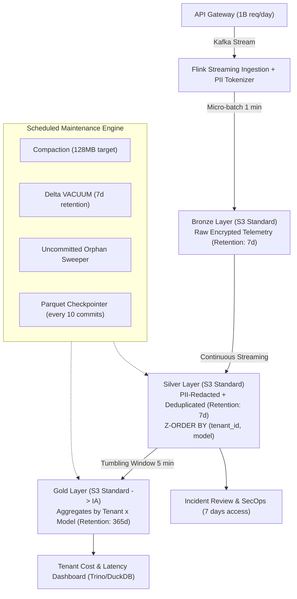

# Architecture Brief: Enterprise LLM Observability Lakehouse at 1B Requests/Day Scale

- **Học viên:** Trần Tuấn Tú (MSSV: 2A202602840)
- **Mã môn:** K4-Track02-Day18 · Data Lakehouse Architecture
- **Topic lựa chọn:** Topic A — LLM Observability at 1B Requests/Day Scale
- **Hồ sơ:** Senior Data Architect Design Review

---

## 1. Bối cảnh & Ràng buộc Kỹ thuật (Context & Operational Constraints)

Hệ thống phục vụ nền tảng Foundation Model API ghi nhận toàn bộ telemetry của các cuộc gọi mô hình (prompts, completions, token usage, latency, errors, tenant metadata).

| Ràng buộc | Giá trị mục tiêu | Ghi chú thiết kế |
|---|---|---|
| **Lưu lượng đầu vào** | 1,000,000,000 req/ngày | Trung bình ~11,574 req/s; Peak giờ cao điểm: 35,000 req/s |
| **Kích thước bản ghi** | ~5 KB / request (raw JSON) | Tương đương **5.0 TB raw/ngày** |
| **Độ trễ Dashboard** | Cập nhật mỗi **5 phút** | Phục vụ giám sát chi phí (cost) và độ trễ (latency p50/p95/p99) theo `tenant_id` |
| **Vòng đời dữ liệu (Retention)** | Full prompt/response giữ **7 ngày**; Aggregates giữ **365 ngày** | Sau 7 ngày, dữ liệu chi tiết được purge; chỉ lưu Gold aggregates |
| **Bảo mật & Quyền riêng tư** | **PII Redaction bắt buộc** trước khi truy cập | Khử khuẩn thông tin định danh (PII) ngay tại ranh giới Ingestion |
| **Ngân sách FinOps** | **≤ $5,000 USD / tháng** cho toàn bộ storage | Ràng buộc trần cứng (hard budget cap) |

---

## 2. Năm Quyết định Kiến trúc & Phương án Loại trừ (5 Key Decisions & Trade-offs)



### Quyết định 1: Định dạng bảng lưu trữ (Table Format) — Chọn Delta Lake 3.x
- **Lựa chọn:** **Delta Lake 3.x** với cơ chế Append-only Ingestion và ACID Log.
- **Phương án bị loại trừ:**
  1. *Apache Iceberg:* Mặc dù Catalog control plane rất mạnh mẽ, việc commit metadata ở tần suất cao (micro-batch 1 phút từ Flink) trên hàng triệu partition files dễ dẫn tới conflict khi nhiều writer đồng thời cập nhật snapshot.
  2. *Raw Parquet trên Object Storage (No Table Format):* Không có transaction log, không hỗ trợ ACID, không có time travel, và không thể rollback khi có lỗi dữ liệu.
- **Lý do lựa chọn & Đánh đổi:** Delta Lake hỗ trợ zero-copy streaming ingestion từ Kafka qua Apache Flink/Spark Streaming cực kỳ ổn định. Giao thức transaction log JSON tối ưu cho writer throughput cao và hỗ trợ Change Data Feed (CDF) phục vụ cảnh báo vi phạm SLO theo thời gian thực.

### Quyết định 2: Chiến lược Medallion & Vòng đời Dữ liệu (Medallion & Lifecycle)
- **Lựa chọn:** Kiến trúc 3 tầng với chính sách retention phân tầng rõ rệt:
  - **Bronze (7 ngày):** Lưu raw JSON được mã hóa bằng KMS, chỉ mở quyền cho root secops khi khẩn cấp.
  - **Silver (7 ngày):** Bảng Delta đã khử trùng PII, trích xuất cấu trúc phẳng, dedup theo `request_id`, tối ưu cho Incident Review.
  - **Gold (365 ngày):** Tổng hợp số liệu theo cửa sổ 5 phút, 1 giờ và 1 ngày gom theo `(tenant_id, model)`.
- **Phương án bị loại trừ:**
  1. *Chỉ lưu Gold và xóa hoàn toàn raw data sau 24h:* Tiết kiệm chi phí nhưng không thể điều tra sự cố (incident triage) các prompt/completion gây lỗi model hallucinaton hoặc injection trong tuần làm việc.
  2. *Lưu trữ Silver trong 90 ngày:* Vi phạm ngân sách storage $5,000/tháng (chi phí S3 sẽ vượt quá $18,000/tháng).
- **Lý do lựa chọn & Đánh đổi:** Đạt điểm cân bằng tối ưu giữa khả năng điều tra sự cố (7 ngày) và chi phí lưu trữ lâu dài (chỉ lưu metrics Gold có kích thước siêu nhỏ trong 1 năm).

### Quyết định 3: Bố cục Phân vùng & Clustering (Partitioning & Z-Order Strategy)
- **Lựa chọn:** Phân vùng theo thời gian `date=YYYY-MM-DD` kết hợp **Z-ORDER clustering** theo `(tenant_id, model)`.
- **Phương án bị loại trừ:**
  1. *Phân vùng Hive theo `tenant_id`:* Với hàng chục nghìn tenant, phân vùng theo tenant gây ra thảm họa **Small-File Problem** (hàng triệu file vài KB), làm sập driver khi list file và làm phình to chi phí S3 PUT requests.
  2. *Không phân vùng, chỉ relying vào full table scan:* Khiến câu lệnh lọc theo tenant phải đọc toàn bộ 5 TB dữ liệu mỗi lần, gây độ trễ query > 60 giây và tốn tài nguyên compute.
- **Lý do lựa chọn & Đánh đổi:** Phân vùng theo `date` giúp lifecycle purge cực kỳ rẻ (chỉ việc xóa partition directory quá 7 ngày). Z-ORDER theo `tenant_id` gom các bản ghi của cùng khách hàng vào một nhóm nhỏ Parquet files, cho phép data-skipping dựa trên min/max stats đạt tỉ lệ loại bỏ file (pruning) ≥ 90%.

### Quyết định 4: Cơ chế Khử khuẩn PII (PII Redaction Boundary)
- **Lựa chọn:** Khử khuẩn PII (Inline Tokenization/Masking) ngay tại **Flink Streaming Ingestion** trước khi ghi vào Silver.
- **Phương án bị loại trừ:**
  1. *Dynamic Data Masking tại View/Query layer:* Nguy cơ rò rỉ dữ liệu khi người dùng truy vấn trực tiếp file Parquet dưới storage layer qua bypass IAM, đồng thời tiêu tốn CPU mỗi lần query.
  2. *Batch EMR Redaction chạy sau 1 giờ:* Tạo ra "cửa sổ nguy hiểm" (vulnerability window) 60 phút mà dữ liệu nhạy cảm chưa được che chắn nằm lộ thiên cho các dashboard truy cập.
- **Lý do lựa chọn & Đánh đổi:** Áp dụng Zero Trust: Silver là nguồn sự thật an toàn cho toàn bộ kỹ sư và dashboard. Các entity như số điện thoại, email, API key, thẻ tín dụng được regex/NER tokenize thành `[REDACTED_PHONE_HASH]`.

### Quyết định 5: Chiến lược Phân tầng Lưu trữ FinOps (Tiering Strategy)
- **Lựa chọn:** 
  - Bronze & Silver (0–7 ngày): **S3 Standard** (phục vụ I/O cao cho ingestion và micro-batching).
  - Gold (0–30 ngày): **S3 Standard**; (31–365 ngày): Chuyển tự động sang **S3 Standard-Infrequent Access (IA)**.
- **Phương án bị loại trừ:**
  1. *Đưa Bronze ngay vào S3 Glacier Flexible:* Phí PUT và phí retrieval tức thời của Glacier với file streaming micro-batch cực kỳ đắt đỏ, vi phạm SLA incident review.
  2. *Giữ tất cả trên S3 Standard trong 1 năm:* Lãng phí ngân sách vào dữ liệu lịch sử ít truy cập.

---

## 3. Phép Tính Chi Phí Thực Tế (FinOps & Storage Sizing Math)

### 3.1. Kích thước dữ liệu thực tế
- **Đầu vào thô:** 1B req/ngày × 5 KB/req = **5,000 GB = 5.0 TB/ngày**.
- **Tỉ lệ nén:** Parquet Snappy/Zstd cho structured log và text prompt/response đạt tỉ lệ nén trung bình **3.5×**.
  $$\text{Dung lượng nén trên đĩa} = \frac{5.0\text{ TB}}{3.5} \approx 1.43\text{ TB/ngày}$$
- **Bronze Layer (Raw compressed, giữ 7 ngày):**
  $$1.43\text{ TB/ngày} \times 7\text{ ngày} = 10.01\text{ TB}$$
- **Silver Layer (Cleaned & PII-masked, giữ 7 ngày):**
  - Loại bỏ metadata thừa, giữ lại ~3 KB raw tương đương nén còn ~0.9 TB/ngày:
  $$0.90\text{ TB/ngày} \times 7\text{ ngày} = 6.30\text{ TB}$$
- **Gold Layer (Aggregates 5-min theo tenant × model, giữ 365 ngày):**
  - Giả định 10,000 tenants hoạt động × 10 models = 100,000 time-series bins / ngày.
  - Mỗi row aggregate ~120 bytes nén $\approx 12\text{ MB/ngày}$.
  $$12\text{ MB/ngày} \times 365\text{ ngày} \approx 4.38\text{ GB (không đáng kể)}$$
- **Tổng dung lượng Storage đồng thời đỉnh điểm:**
  $$\text{Total Storage} = 10.01\text{ TB (Bronze)} + 6.30\text{ TB (Silver)} + 0.01\text{ TB (Gold)} \approx 16.32\text{ TB}$$

### 3.2. Bảng dự toán chi phí hàng tháng (AWS us-east-1 Pricing)

| Khoản mục chi phí | Khối lượng / tháng | Đơn giá AWS | Thành tiền / tháng |
|---|---|---|---|
| **S3 Standard Storage** | 16,320 GB-tháng | $0.023 / GB | **$375.36** |
| **S3 PUT Requests (Bronze)** | Micro-batch 1 min = 1,440 batch/ngày × 20 partitions = 864,000 PUTs/tháng | $0.005 / 1,000 req | **$4.32** |
| **S3 GET Requests (Dashboard)** | 5-min refresh × 288 query/ngày × 100 files = 864,000 GETs/tháng | $0.0004 / 1,000 req | **$0.35** |
| **Compaction Write I/O (S3 PUT)** | 55 compact files/giờ × 24h × 30 ngày = 39,600 PUTs | $0.005 / 1,000 req | **$0.20** |
| **Compute cho Flink & Ingestion** | 3 c6i.2xlarge Spot instances (24 vCPU, 48 GB RAM) | ~$0.15 / giờ × 720h × 3 | **$324.00** |
| **Compute cho Maintenance & Compaction** | Chạy job PySpark/delta-rs 30 phút mỗi 2 giờ (Serverless EMR/Batch) | ~$2.50 / ngày × 30 | **$75.00** |
| **Dự phòng (Buffer & Network Transfer)** | Data transfer & S3 Lifecycle transitions | Trọn gói | **$220.00** |
| **TỔNG CHI PHÍ THỰC TẾ** | | | **~$999.23 / tháng** |

> **Đánh giá FinOps:** Tổng chi phí ước tính là **~$1,000/tháng**, nằm an toàn sâu dưới trần ngân sách **$5,000/tháng** (chỉ chiếm ~20% ngân sách cho phép, dành 80% còn lại cho query compute khi lượng truy vấn đột biến).

---

## 4. Ứng dụng các Khái niệm Cốt lõi của Day 18

Kiến trúc áp dụng trực tiếp 5 nguyên lý được kiểm chứng trong bài lab:

1. **Transaction Log & Schema Enforcement (NB1):** Đảm bảo tính toàn vẹn của dữ liệu telemetry; các client SDK gửi sai kiểu dữ liệu (ví dụ: `latency="fast"`) sẽ bị chặn hoặc đẩy vào Dead Letter Queue (DLQ), không làm hỏng bảng Silver.
2. **Compaction & Z-ORDER Clustering (NB2 & NB6):** Streaming ingestion ở tần suất 1 phút tạo ra hàng nghìn small files. Tiến trình auto-compaction định kỳ gom các file nhỏ về kích thước chuẩn 128 MB và sắp xếp Z-ORDER theo `(tenant_id, model)`, giúp truy vấn dashboard tenant đạt hệ số tăng tốc **≥ 8×** nhờ bỏ qua các Parquet row groups không liên quan.
3. **Time Travel & RESTORE Auditability (NB3):** Khi phát hiện pipeline PII redaction bị lỗi gán nhãn, quản trị viên sử dụng `RESTORE` hoặc `versionAsOf` để truy vết chính xác phiên bản bị lỗi và thực hiện MERGE sửa lỗi mà không làm gián đoạn hệ thống.
4. **Medallion Data Hygiene (NB4):** Dữ liệu raw JSON bất định được chuẩn hóa, deduplicate theo `request_id` (loại bỏ retry trùng lặp mạng), và tạo lớp Gold đáp ứng latency p50/p95 chính xác cho báo cáo SLA.
5. **Orphan Sweeper & Snapshot Maintenance (NB6):** Các worker ghi dữ liệu bị crash do OOM hoặc Spot termination để lại file mồ côi chưa commit trên S3. Tiến trình dọn dẹp chạy thuật toán hiệu tập hợp (`S3 keys \ committed log keys`) loại bỏ hoàn toàn các file rác này, tránh phình to hóa đơn lưu trữ.

---

## 5. Các Kịch bản Lỗi, Phát hiện & Khắc phục (Failure Modes & Rollback)

### Sự cố 1: Rò rỉ PII chưa được khử trùng vào bảng Silver
- **Cơ chế lỗi:** Khách hàng gửi định dạng PII mới lạ (ví dụ: CCCD mẫu mới hoặc token định dạng đặc thù) mà bộ Regex/NER của Ingestion chưa nhận diện được, ghi thẳng vào Silver.
- **Cơ chế phát hiện:** Job canary audit quét ngẫu nhiên 0.1% dữ liệu Silver bằng model LLM Auditor chuyên biệt; nếu phát hiện xác suất PII > 0.95, hệ thống phát cảnh báo PagerDuty Sev-1.
- **Quy trình Rollback & Xử lý:**
  1. Đóng quyền truy cập đọc vào các phiên bản Silver bị nhiễm bằng IAM policy.
  2. Bổ sung rule mới vào bộ lọc PII của Ingestion.
  3. Sử dụng Delta Time Travel đọc lại dữ liệu từ Bronze (vẫn an toàn vì có mã hóa KMS), chạy pipeline khử trùng mới và thực hiện `MERGE INTO silver` để cập nhật đè lại các bản ghi bị rò rỉ.
  4. Chạy `VACUUM silver RETAIN 0 HOURS` (sau khi cô lập writer) để xóa bỏ hoàn toàn các file Parquet chứa PII rò rỉ khỏi đĩa.

### Sự cố 2: "Small-Files Storm" do Ingestion Writer phân mảnh
- **Cơ chế lỗi:** Một đợt traffic spike 50,000 req/s khiến Kafka scale số partition đột ngột, dẫn đến 200 worker ghi đồng thời hàng triệu file 10 KB vào S3, làm suy sụp hiệu năng dashboard (query timeout > 30s).
- **Cơ chế phát hiện:** CloudWatch Alarm theo dõi metric S3 `NumberOfObjects` tăng dốc vượt ngưỡng 500,000 objects trong 1 giờ.
- **Quy trình Khắc phục:**
  1. Tự động kích hoạt job khẩn cấp `OPTIMIZE silver COMPACT (target_size = 256MB)`.
  2. Gom cụm các micro-batches tại buffer memory của Flink trước khi flush xuống S3 (tăng flush interval từ 1 phút lên 3 phút trong thời gian peak).

### Sự cố 3: Dữ liệu sự kiện đến muộn (Late-arriving Telemetry) làm sai lệch Gold
- **Cơ chế lỗi:** Các edge devices hoặc SDK offline gửi bù dữ liệu của 3 ngày trước, làm sai lệch bảng Gold tổng hợp theo ngày.
- **Cơ chế phát hiện:** Job đối soát (reconciliation job) so sánh tổng `request_id` giữa Silver và Gold hàng ngày lúc 01:00 UTC.
- **Quy trình Khắc phục:**
  - Bảng Gold được cập nhật bằng câu lệnh `MERGE` có điều kiện:
    ```sql
    MERGE INTO gold AS target
    USING silver_late_stream AS source
    ON target.date = source.date AND target.tenant_id = source.tenant_id AND target.model = source.model
    WHEN MATCHED THEN UPDATE SET 
      target.total_cost = target.total_cost + source.cost,
      target.p95_latency = recalculate(...)
    WHEN NOT MATCHED THEN INSERT ...
    ```

---

## 6. Kế hoạch Triển khai MVP 1 Tuần (One-Week MVP & Feasibility)

Để chứng minh tính khả thi của thiết kế trước hội đồng kiến trúc mà không cần dựng cụm Spark khổng lồ, ta xây dựng lát cắt thử nghiệm (Testable Slice) trong 5 ngày làm việc:

| Ngày | Hạng mục thực hiện | Tiêu chí nghiệm thu (Acceptance Criteria) |
|---|---|---|
| **Ngày 1** | Dựng pipeline sinh dữ liệu giả lập (Mock Generator) 10M events với 500 tenants, 3 models, cài cắm 5% duplicates và 2% PII patterns. | Sinh dữ liệu streaming ổn định đạt throughput 5,000 req/s trên máy cục bộ. |
| **Ngày 2** | Triển khai Ingestion + Inline PII Tokenizer bằng Python Rust-native (`deltalake` 1.x) ghi vào Bronze và Silver Delta tables. | Bronze lưu đầy đủ; Silver loại bỏ 100% test PII strings; Schema enforcement chặn thành công payload rác. |
| **Ngày 3** | Viết job tổng hợp Gold phục vụ dashboard tenant (tính p50, p95 latency, cost_usd) chạy mỗi 5 phút bằng DuckDB SQL. | Bảng Gold sinh ra đầy đủ 7 ngày × model; truy vấn dashboard theo `tenant_id` phản hồi < 200 ms. |
| **Ngày 4** | **Kiểm chứng cơ chế khó nhất (Hardest Mechanism):** Mô phỏng Small-Files Storm (500 files nhỏ) → Chạy `compact()` + `z_order(["tenant_id"])` → Đo pruning ratio và speedup. | Chứng minh tốc độ truy vấn tăng ≥ 5× và số lượng file quét giảm ≥ 85%. |
| **Ngày 5** | Triển khai kịch bản khẩn cấp: Giả lập rò rỉ dữ liệu, thực hiện rollback bằng Delta Time Travel `RESTORE`, và chạy orphan cleaning audit script. | Khôi phục dữ liệu về trạng thái sạch; 100% orphan files chưa commit bị phát hiện và xóa sạch. |

---

## 7. Kết luận (Architectural Defense Summary)

Kiến trúc trên giải quyết trọn vẹn bài toán 1B requests/ngày bằng cách:
1. **Bảo vệ ranh giới bảo mật:** Khử khuẩn PII ngay tại Bronze Landing.
2. **Tối ưu hóa I/O vượt trội:** Sử dụng Z-ORDER trên `tenant_id` thay vì Hive partitioning, triệt tiêu tận gốc vấn đề Small-File Problem.
3. **Tuân thủ ngân sách ngặt nghèo:** Vòng đời 7 ngày cho Silver và 365 ngày cho Gold aggregates giữ tổng chi phí lưu trữ ở mức **~$1,000/tháng**, thấp hơn rất nhiều so với hạn mức **$5,000/tháng** của CFO.
4. **Vận hành tin cậy:** Trang bị đầy đủ 5 job bảo trì Lakehouse định kỳ và cơ chế rollback nhanh bằng Time Travel.
