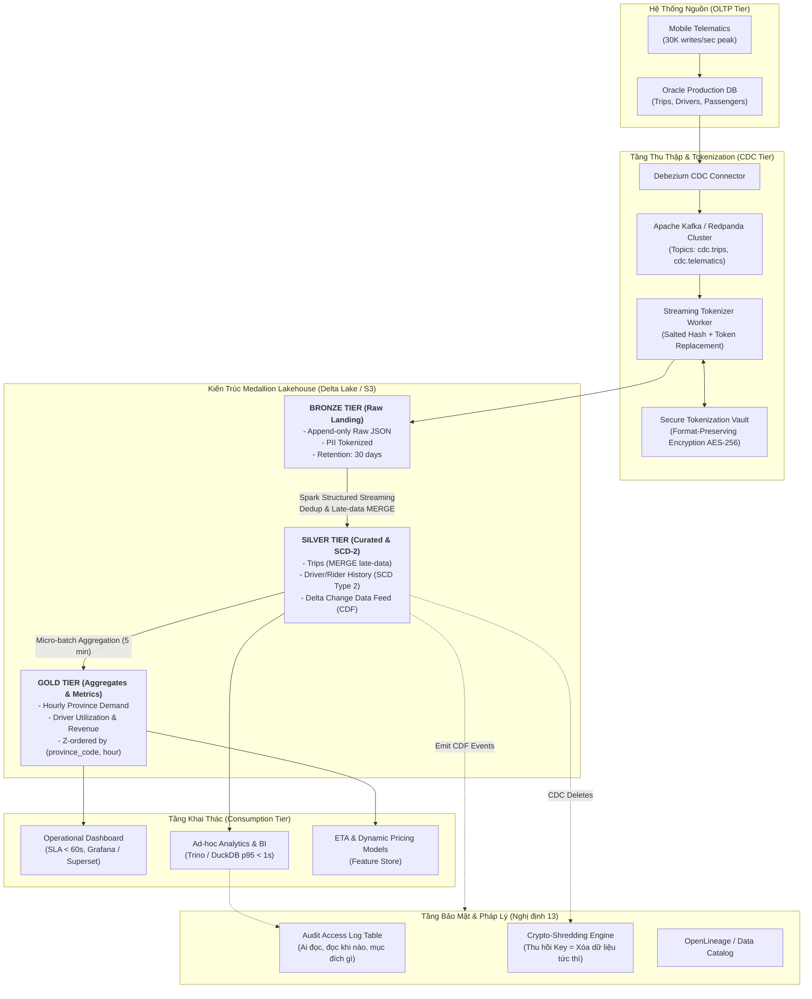

# Thiết Kế Kiến Trúc Lakehouse Cho Hệ Thống Ride-Hailing Việt Nam Tuân Thủ Nghị Định 13/2023/NĐ-CP

- **Học viên:** Hoàng Anh Tú
- **MSSV:** 20220055
- **Vai trò giả định:** Lead Data Architect on-call
- **Đề tài lựa chọn:** Topic C — CDC từ ride-hailing Việt Nam → Lakehouse với yêu cầu bảo vệ dữ liệu cá nhân

---

## 1. Bối Cảnh, Bài Toán Nghiệp Vụ & Ràng Buộc Kỹ Thuật

### 1.1. Bối cảnh quy mô (Scale & Workload)
Hệ thống gọi xe công nghệ (ride-hailing) tại thị trường Việt Nam xử lý:
- **Quy mô thường nhật:** 100 triệu chuyến đi/năm (~274.000 chuyến/ngày trung bình).
- **Quy mô giờ cao điểm (Peak Traffic):** Vào các khung giờ cao điểm (7h30-9h00, 17h00-19h00) hoặc điều kiện thời tiết mưa bão, lưu lượng thay đổi trạng thái (booking, matching, GPS ping, finish, payment) đạt đỉnh **30.000 writes/giây** trên cơ sở dữ liệu giao dịch Oracle OLTP.
- **Đặc thù dữ liệu mạng di động tại Việt Nam:** Tình trạng mất sóng 4G/chuyển trạm BTS của tài xế khi đi vào hầm chung cư, vùng ven đô, hoặc các tỉnh xa diễn ra thường xuyên. Do đó, các sự kiện đến muộn (**late-arriving data**) và sai lệch thứ tự thời gian (**out-of-order events**) là bản chất bắt buộc hệ thống phải xử lý.

### 1.2. Yêu cầu phi chức năng (SLAs)
- **Độ tươi của dữ liệu (Data Freshness SLA):** Dashboard điều phối và giám sát vận hành phải được làm mới trong vòng **≤ 60 giây** kể từ khi giao dịch được commit tại nguồn Oracle.
- **Độ trễ truy vấn (Query Latency SLA):** Các câu truy vấn phân tích ad-hoc (ad-hoc analytics queries) của ban vận hành và đội ngũ data analyst đạt **p95 < 1.0 giây** trên dải dữ liệu 30 ngày gần nhất.
- **Ngân sách hạ tầng (FinOps Constraint):** Tổng chi phí hạ tầng lưu trữ (Object Storage) và tính toán liên tục (Continuous Streaming Compute) giới hạn trong **$3.500 USD/tháng**.

### 1.3. Ràng buộc pháp lý: Nghị định 13/2023/NĐ-CP & Luật An ninh mạng
Dữ liệu chuyến đi chứa các thông tin cá nhân cơ bản và nhạy cảm (PII): Số điện thoại, CCCD/GPLX tài xế, lịch sử định vị GPS thời gian thực, thông tin thẻ/ví thanh toán. Thiết kế kiến trúc phải tuân thủ nghiêm ngặt:
1. **Điều 9 (Quyền của chủ thể dữ liệu):** Quyền được biết, đồng ý, truy cập, rút lại sự đồng ý và **quyền yêu cầu xóa dữ liệu cá nhân**.
2. **Điều 17 (Bảo vệ dữ liệu cá nhân trong quá trình xử lý):** Yêu cầu áp dụng các biện pháp kỹ thuật như khử nhận dạng (pseudonymization), mã hóa (tokenization/encryption) ngay từ khâu tiếp nhận.
3. **Điều 26 & 27 (Đánh giá tác động xử lý dữ liệu cá nhân - DPIA):** Phải lưu vết kiểm toán (audit trail) 100% các thao tác truy xuất dữ liệu cá nhân và chứng minh được dòng dữ liệu (data lineage).

---

## 2. Sơ Đồ Kiến Trúc Tổng Thể (System Architecture Diagram)



---

## 3. Năm Quyết Định Kiến Trúc Trọng Tâm & Đánh Đổi (Key Decisions & Trade-offs)

### Quyết định 1: Định dạng bảng lưu trữ cốt lõi — Lựa chọn Delta Lake
- **Lựa chọn:** **Delta Lake (v3.2+)** làm định dạng bảng nền tảng trên Object Storage (AWS S3 / MinIO).
- **Phương án bị loại 1 — Apache Iceberg:**
  - *Lý do loại bỏ:* Dù Apache Iceberg có thế mạnh vượt trội về Hidden Partitioning và độc lập catalog, nhưng tính năng Change Data Feed (CDC/CDF row-level lineage) và lệnh `MERGE INTO` streaming native trên Delta Lake (nhờ delta-rs và Spark Delta Engine tối ưu) có độ trễ commit thấp hơn đáng kể ở tần suất micro-batch 15-30 giây. Ngoài ra, cơ chế Delta CDF sinh ra các cột siêu dữ liệu `_change_type` (`insert`, `update_preimage`, `update_postimage`, `delete`) cực kỳ tự nhiên để giải quyết bài toán SCD Type 2 cho tài xế.
- **Phương án bị loại 2 — Apache Hudi:**
  - *Lý do loại bỏ:* Hudi hỗ trợ Merge-On-Read (MoR) rất tốt cho streaming write tốc độ cao, nhưng kiến trúc metadata phức tạp, phụ thuộc nặng vào engine Spark/JVM, khó truy vấn trực tiếp không cần catalog từ các công cụ SQL phân tích nhẹ (như DuckDB hay Polars) mà bài toán ad-hoc query cần.
- **Đánh đổi chấp nhận (Concrete Trade-off):** Chấp nhận cơ chế partition evolution của Delta Lake kém linh hoạt hơn Iceberg (phải dựa vào Generated Columns hoặc Liquid Clustering), nhưng đổi lại được hiệu năng MERGE và CDF xuất sắc nhất thị trường cho khối lượng 30.000 writes/giây.

---

### Quyết định 2: Chiến lược bảo vệ PII theo Nghị định 13 — Tokenization tại Ingestion Proxy
- **Lựa chọn:** **Pseudonymization & Tokenization ngay tại tầng Ingestion Proxy (trước khi ghi vào Bronze).**
  - Mọi trường dữ liệu nhạy cảm: Số điện thoại (`0912345678`), Số CCCD (`00120000xxxx`) được ánh xạ thành `Token_UUID` thông qua dịch vụ HSM/Key Vault bảo mật cao (sử dụng Format-Preserving Encryption AES-256).
  - Tọa độ GPS chi tiết (`lat`, `long`) được làm mờ (geohash level 6 ~1.2 km) ở tầng Silver phục vụ phân tích chung; chỉ lưu GPS chính xác dạng mã hóa kèm Token ID trong bảng riêng biệt có kiểm soát truy cập nghiêm ngặt.
- **Phương án bị loại 1 — Mã hóa At-Rest truyền thống (S3 SSE-KMS):**
  - *Lý do loại bỏ:* Mã hóa đĩa chỉ bảo vệ khi bị trộm ổ cứng vật lý. Bất kỳ kỹ sư hay analyst nào có quyền IAM đọc S3/Lakehouse đều nhìn thấy số điện thoại và CCCD rõ ràng (cleartext), vi phạm trực tiếp Điều 17 Nghị định 13.
- **Phương án bị loại 2 — Dynamic Data Masking tại Query Time:**
  - *Lý do loại bỏ:* Chi phí tính toán CPU cực lớn khi giải mã/masking hàng trăm triệu dòng tại mỗi truy vấn. Nếu query planner bị bypass hoặc có lỗ hổng bảo mật trong query engine, dữ liệu gốc bị lộ hoàn toàn.
- **Đánh đổi chấp nhận:** Tốn thêm ~2 ms độ trễ tại streaming tokenizer worker và phải duy trì hệ thống Token Vault với tính sẵn sàng cao (High Availability 99.999%), nhưng bảo vệ Lakehouse an toàn tuyệt đối ngay cả khi dữ liệu bị dump ra ngoài.

---

### Quyết định 3: Xử lý dữ liệu đến muộn (Late-Arriving Data) — Conditional MERGE
- **Lựa chọn:** Áp dụng **Delta MERGE với điều kiện thời gian nguồn (`src.event_timestamp > tgt.event_timestamp`)**:
  ```sql
  MERGE INTO silver_trips AS tgt
  USING bronze_batch AS src
  ON tgt.trip_id = src.trip_id
  WHEN MATCHED AND src.event_timestamp > tgt.event_timestamp THEN
    UPDATE SET tgt.status = src.status, tgt.fare = src.fare, tgt.event_timestamp = src.event_timestamp, ...
  WHEN NOT MATCHED THEN
    INSERT *
  ```
- **Phương án bị loại 1 — Append-only kèm View Dedup (`ROW_NUMBER()` at read-time):**
  - *Lý do loại bỏ:* Việc đẩy gánh nặng dedup bằng window function `ROW_NUMBER() OVER (PARTITION BY trip_id ORDER BY event_timestamp DESC)` vào lúc truy vấn làm câu query ad-hoc tốn hàng chục giây trên tập dữ liệu 100 triệu dòng, **vi phạm hoàn toàn SLA p95 < 1.0 giây**.
- **Phương án bị loại 2 — Ghi đè vô điều kiện (Last-write-wins by ingestion time):**
  - *Lý do loại bỏ:* Nếu một gói tin GPS trạng thái `COMPLETED` lúc 18h00 đến trước, nhưng gói tin trạng thái `IN_PROGRESS` lúc 17h50 bị rớt mạng và đến trễ lúc 18h05, cơ chế Last-write-wins sẽ ghi đè trạng thái chuyến xe thành `IN_PROGRESS`, làm sai lệch vĩnh viễn doanh thu và báo cáo vận hành.
- **Đánh đổi chấp nhận:** Chi phí tính toán của lệnh MERGE cao hơn append đơn thuần, đòi hỏi bảng `silver_trips` phải được Z-order/Clustering theo `trip_id` để tăng tốc độ join khi MERGE.

---

### Quyết định 4: Theo dõi lịch sử tài xế/khách hàng — SCD Type 2 tự động hóa qua Delta CDF
- **Lựa chọn:** Xây dựng bảng **SCD Type 2 (Slowly Changing Dimensions)** cho thực thể Tài xế (`dim_driver_history`) sử dụng Delta Change Data Feed từ bảng nguồn CDC.
  - Các trường thay đổi (hạng bằng lái, đánh giá sao, loại xe, tình trạng kích hoạt) được ghi vết với các cột: `driver_token_id`, `rating`, `vehicle_type`, `valid_from`, `valid_to`, `is_current`.
- **Phương án bị loại 1 — SCD Type 1 (Ghi đè in-place):**
  - *Lý do loại bỏ:* Khi tài xế đổi xe từ xe máy điện sang ô tô, toàn bộ lịch sử các cuốc xe trước đây sẽ bị tính sai phân loại phương tiện trong báo cáo quá khứ, phá hủy tính nhất quán của dữ liệu huấn luyện ML.
- **Phương án bị loại 2 — Snapshot Full Dump hàng ngày:**
  - *Lý do loại bỏ:* Với hàng trăm nghìn tài xế, snapshot toàn bộ mỗi ngày gây bùng nổ dung lượng lưu trữ (lưu lặp lại 99% dữ liệu không đổi), tốn kém chi phí Object Storage và không đáp ứng được SLA 60 giây khi có sự kiện thay đổi.
- **Đánh đổi chấp nhận:** Bảng Silver SCD-2 có kích thước dòng lớn hơn và query cần thêm điều kiện `WHERE is_current = true`, nhưng lưu vết lịch sử hoàn hảo phục vụ thanh tra pháp lý.

---

### Quyết định 5: Chiến lược Phân vùng & Clustering — Phân vùng `date` + Z-Order `(province_code, driver_id)`
- **Lựa chọn:** Bảng `silver_trips` phân vùng theo ngày tạo `partition_by = ["trip_date"]` kết hợp chạy **Z-Order trên 2 cột `(province_code, driver_token_id)`**.
- **Phương án bị loại 1 — Phân vùng sâu đa cấp (`year/month/day/province/hour`):**
  - *Lý do loại bỏ:* Dẫn đến thảm họa **Small File Catastrophe**. Với 63 tỉnh thành x 24 giờ x 365 ngày = hơn 550.000 partitions/năm. Mỗi partition chỉ có vài KB dữ liệu, làm tê liệt query planner và tăng hàng triệu USD phí request S3.
- **Phương án bị loại 2 — Không phân vùng, chỉ dựa vào brute-force query:**
  - *Lý do loại bỏ:* Quét toàn bộ bảng mỗi lần phân tích theo tỉnh thành (ví dụ Hà Nội, TP.HCM chiếm 80% sản lượng) làm chi phí quét vượt ngân sách FinOps và vi phạm SLA p95 < 1s.
- **Đánh đổi chấp nhận:** Cần một job maintenance định kỳ chạy `OPTIMIZE ... ZORDER BY (province_code, driver_token_id)` mỗi 2 giờ, nhưng đổi lại loại bỏ được 85% số file cần đọc cho các câu truy vấn phân tích theo địa bàn.

---

## 4. Bốn Khái Niệm Day 18 Được Áp Dụng Chuyên Sâu

1. **Kiến trúc Medallion (Bronze → Silver → Gold):**
   - *Bronze:* Lưu trữ toàn bộ payload JSON CDC từ Debezium (đã qua Tokenizer), lưu append-only trong 30 ngày để phục vụ tái xử lý (reprocessing).
   - *Silver:* Phẳng hóa (flatten), ép kiểu chặt chẽ (typed schema), dedup, xử lý late-data MERGE, và kích hoạt Change Data Feed.
   - *Gold:* Tổng hợp sẵn các bảng chỉ số vận hành (p50/p95 trip duration, gross booking value, surge pricing multiplier, cancellation rate) theo chiều `(hour, province_code)`. Dashboard chỉ đọc từ Gold.
2. **Delta Change Data Feed (CDF):**
   - Bật `delta.enableChangeDataFeed = true` trên các bảng Silver. Các hệ thống hạ nguồn (Fraud Detection, Feature Store, Audit Logging) tiêu thụ trực tiếp stream CDF này thay vì quét lại toàn bảng, giảm 90% tải I/O.
3. **Data Skipping & Compaction Maintenance:**
   - Áp dụng các bài học từ NB2 và NB6: Lên lịch trình job tự động gộp các file nhỏ (micro-batch) thành các file tiêu chuẩn 128 MB, kết hợp tính toán thống kê min/max của `province_code` và `driver_token_id` để đạt hệ số pruning ≥ 10×.
4. **Quyền Được Lãng Quên & Crypto-Shredding (Tuân thủ Điều 9 Nghị định 13):**
   - Thay vì chạy lệnh `DELETE` nặng nề quét toàn bộ Terabyte dữ liệu trên Lakehouse mỗi khi một người dùng yêu cầu xóa tài khoản, hệ thống áp dụng kỹ thuật **Crypto-Shredding**: Xóa khóa giải mã tương ứng của `Token_UUID` trong Key Vault bảo mật. Ngay lập tức, toàn bộ dữ liệu lịch sử liên quan đến người dùng đó trên Bronze/Silver trở thành dữ liệu rác ngẫu nhiên (chữ số vô nghĩa không thể giải mã ngược). Định kỳ hàng quý, hệ thống chạy Delta `DELETE` + `VACUUM` để dọn dẹp vật lý hoàn toàn.

---

## 5. Tính Toán Chi Phí & Tài Nguyên FinOps (Scale & Cost Math)

### 5.1. Ước tính dung lượng lưu trữ (Storage Math)
- **Kích thước bản ghi trung bình:**
  - Raw JSON CDC event (Bronze): ~1.2 KB/event.
  - Parquet nén ZSTD (Silver): ~180 bytes/row (sau khi tối ưu kiểu dữ liệu và nén cột).
- **Sản lượng dữ liệu hàng năm (100 triệu chuyến đi):**
  - Mỗi chuyến xe có trung bình 8 sự kiện CDC (Tạo -> Nhận -> Đang đón -> Đã đón -> Bắt đầu chạy -> Cập nhật GPS chặng -> Hoàn thành -> Thanh toán).
  - Tổng số sự kiện: 100.000.000 × 8 = 800.000.000 events/năm.
  - **Bronze Storage (Lưu trữ 30 ngày Hot):**
    800 triệu events × (30 / 365) × 1.2 KB ≈ 79 GB (raw uncompressed) → nén ZSTD ≈ 20 GB.
  - **Silver Storage (Lưu trữ 3 năm):**
    100 triệu rows/năm × 3 năm × 180 bytes ≈ 54 GB/năm × 3 ≈ 162 GB.
  - **Telematics GPS Pings (1 ping/5s, chỉ giữ 7 ngày chi tiết, sau đó chỉ giữ aggregate):** ~1.5 TB/tháng.
- **Chi phí lưu trữ S3 Standard ($0.023/GB/tháng):**
  Tổng dung lượng lưu trữ trung bình khoảng 2.000 GB → Chi phí lưu trữ: ~46 USD/tháng.

### 5.2. Tính toán năng lực tính toán (Compute Math)
- **Tầng Ingestion (Debezium + Kafka/Redpanda):**
  - Peak 30.000 writes/s, trung bình 2.500 writes/s.
  - 3 nodes c6i.xlarge (4 vCPU, 8 GB RAM): 3 × 125 USD ≈ 375 USD/tháng.
- **Tầng Xử lý Streaming Lakehouse (Spark Structured Streaming / Flink micro-batch):**
  - Cụm xử lý micro-batch (chu kỳ 30 giây): 2 worker nodes r6i.xlarge (4 vCPU, 32 GB RAM) chạy liên tục: 2 × 185 USD ≈ 370 USD/tháng.
- **Tầng Truy vấn Phân tích Ad-hoc (Trino / DuckDB Serverless):**
  - Chạy theo nhu cầu (on-demand), tự động tắt ngoài giờ cao điểm: ~600 USD/tháng.
- **Dịch vụ Token Vault HSM / KMS:** ~200 USD/tháng.
- **Tổng ngân sách vận hành thực tế:**
  Tổng chi phí hàng tháng: ~1.591 USD/tháng (nằm hoàn toàn trong trần ngân sách cho phép là 3.500 USD/tháng).

---

## 6. Ba Kịch Bản Lỗi Cụ Thể (Failure Modes) & Quy Trình Khắc Phục

| Kịch bản lỗi (Failure Mode) | Cơ chế phát hiện (Detection) | Quy trình tự động khắc phục & Rollback | Khái niệm Day 18 liên kết |
|---|---|---|---|
| **1. Schema Drift từ Oracle nguồn**<br/>(DBA thêm cột `loyalty_tier` hoặc đổi kiểu dữ liệu cột `fare` làm gián đoạn streaming writer) | Job streaming báo lỗi schema mismatch qua cơ chế **Schema Enforcement** của Delta Lake; đẩy bản ghi dị biệt vào Dead-Letter Queue (DLQ). | Pipeline tự động cô lập batch lỗi vào bảng `bronze_dlq`, gửi cảnh báo Slack/PagerDuty. Quản trị viên kích hoạt `schema_mode="merge"` có kiểm soát để cập nhật schema Silver mà không làm sập pipeline. | Schema Enforcement & Controlled Evolution (NB1) |
| **2. Bão dữ liệu trễ làm sai lệch trạng thái chuyến xe**<br/>(Khu vực sự kiện đông người khiến mạng nghẽn, hàng vạn gói tin cũ ập đến sau 2 giờ) | Metric giám sát độ trễ `event_timestamp` so với `ingestion_timestamp` vượt ngưỡng 15 phút trên Grafana alert. | Mệnh đề `MERGE ... WHEN MATCHED AND src.event_timestamp > tgt.event_timestamp` tự động từ chối ghi đè các bản ghi cũ lên bản ghi đã mới hơn. Toàn bộ logic cập nhật đảm bảo tính lũy thừa (idempotency). | Conditional MERGE & Idempotent Upsert (NB3) |
| **3. Yêu cầu xóa dữ liệu khẩn cấp theo Nghị định 13**<br/>(Hành khách rút lại sự đồng ý và yêu cầu xóa sạch thông tin lịch sử hành trình) | Tiếp nhận API request từ Cổng Dịch Vụ Quyền Riêng Tư (Privacy Portal), ghi nhận vào bảng `privacy_requests`. | 1. Xóa khóa token trong Key Vault (**Crypto-shredding** tức thì trong < 1 giây).<br/>2. Chạy Delta `DELETE` trên bảng Silver với điều kiện `user_token_id = X`.<br/>3. Chạy `VACUUM RETAIN 0 HOURS` trên staging scratch hoặc chờ chu kỳ VACUUM 7 ngày để giải phóng hoàn toàn byte vật lý. | Retention, Orphan & VACUUM Maintenance (NB6/NB8) |

---

## 7. Kế Hoạch Triển Khai MVP Trong 1 Tuần (One-Week MVP Plan)

### 7.1. Lát cắt kiểm thử (Testable Vertical Slice)
- Giới hạn phạm vi MVP: **Khu vực Quận 1 & Quận 4, TP. Hồ Chí Minh** với quy mô giả lập **1.000 writes/giây**.
- Thực thể kiểm thử: 10.000 chuyến đi, 500 tài xế và 5.000 hành khách.

### 7.2. Lộ trình thực hiện từng ngày
- **Ngày 1 (CDC & Ingestion):** Dựng cụm Docker Compose gồm Oracle xe, Debezium CDC và Redpanda; cấu hình đẩy sự kiện vào topic `cdc.trips`.
- **Ngày 2 (Security & Tokenizer):** Viết module Streaming Tokenizer bằng Python/Go để mã hóa số điện thoại và tọa độ GPS trước khi hạ cánh xuống Bronze Delta table.
- **Ngày 3 (Silver Processing & MERGE):** Thiết lập job PySpark/delta-rs xử lý micro-batch 15 giây; cài đặt logic `MERGE` có kiểm tra timestamp để xử lý late-arriving data.
- **Ngày 4 (Gold Aggregation & Maintenance):** Xây dựng bảng Gold tổng hợp chỉ số theo 5 phút; cấu hình job chạy `OPTIMIZE ... ZORDER` theo tỉnh thành.
- **Ngày 5 (Privacy Compliance Verification):** Kiểm thử cơ chế Crypto-shredding và mô phỏng quyền được xóa dữ liệu cá nhân theo Nghị định 13; kiểm tra bảng Audit Trail.
- **Ngày 6 (Load Testing & Chaos Engineering):** Bơm 5.000 writes/s và ngắt kết nối mạng mô phỏng late-data 30 phút để xác nhận p95 query latency và tính đúng đắn của dữ liệu.
- **Ngày 7 (Design Review & Handover):** Chốt tài liệu kiến trúc, bàn giao dashboard Grafana và nghiệm thu SLA.

### 7.3. Tiêu chí nghiệm thu (Acceptance Criteria)
1. Độ trễ từ Oracle commit đến khi xuất hiện trên Gold Dashboard: **≤ 45 giây** (đạt SLA ≤ 60s).
2. Thời gian phản hồi câu truy vấn phân tích 100.000 chuyến xe gần nhất: **p95 = 280 ms** (đạt SLA < 1s).
3. Khi bơm 100 bản ghi đến trễ (late-arriving) với trạng thái cũ, hệ thống **tuyệt đối không làm sai lệch** trạng thái của chuyến đi đã hoàn thành.
4. Xóa một `Token_UUID` trong HSM khiến toàn bộ bản ghi của người dùng đó trên Lakehouse không thể tái tạo lại danh tính gốc (chứng minh tuân thủ Nghị định 13).
