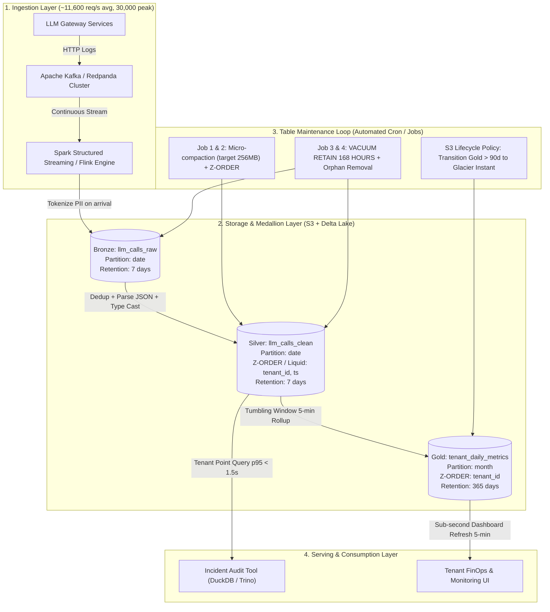

# Architecture Brief: Lakehouse cho LLM Observability ở quy mô 1 Tỷ Requests/Ngày

**Học viên:** Lương Quang Huy  
**MSSV:** 2A202602698  
**Topic:** A — LLM Observability at Scale (1B requests/day)  
**Mục tiêu ngân sách:** Storage budget ≤ $5,000 / tháng  

---

## 1. Problem Statement

Hệ thống Gateway của nền tảng Foundation Model ghi nhận **1 tỷ requests/ngày** từ hàng ngàn khách hàng đa doanh nghiệp (tenants). Mỗi payload log trung bình **5 KB** (chứa metadata gọi, prompt, completion, latency, usage token và audit header), tạo ra lượng dữ liệu thô **5 TB/ngày** (gấp khoảng 150 TB/tháng nạp mới).

**Yêu cầu kỹ thuật và ràng buộc:**
1. **Dashboard SLO:** Cung cấp thông số latency (p50, p95, p99), token consumption và chi phí chi tiết theo `tenant_id`, độ trễ làm mới tối đa **5 phút**.
2. **Lifecycle & Retention:** Dữ liệu prompt/completion đầy đủ chỉ lưu trong **7 ngày** phục vụ rà soát sự cố (incident review) và audit, sau đó tự động hủy; các chỉ số tổng hợp (aggregates) lưu trữ **1 năm**.
3. **Bảo mật & Compliance:** Dữ liệu PII (tên, email, số điện thoại, API keys) phải được **redact/tokenize ngay tại thời điểm Bronze landing** trước khi bất kỳ kỹ sư, nhà phân tích hay dashboard engine nào được phép đọc.
4. **FinOps Cap:** Tổng chi phí lưu trữ đối tượng (Object Storage) bị giới hạn cứng dưới **$5,000 / tháng**.

Cái khó nằm ở sự xung đột giữa **ghi phân tán quy mô lớn (streaming ingestion)**, **yêu cầu truy vấn điểm tốc độ cao theo tenant**, và **áp lực dọn dẹp hàng chục terabyte mỗi ngày mà không làm gián đoạn transaction log hay vi phạm ngân sách lưu trữ**.

---

## 2. Architecture Diagram

Kiến trúc triển khai theo mô hình **Medallion Lakehouse 3 tầng**, kết hợp luồng xử lý streaming vi mô (micro-batching) và vòng lặp bảo trì định kỳ:



### Các khái niệm Day 18 được áp dụng:
1. **Medallion Architecture:** Phân tách rạch ròi trách nhiệm bảo mật và hiệu năng giữa Bronze (raw tokenized), Silver (cleaned, deduped, clustered) và Gold (business aggregates).
2. **ACID Transaction Log & Opt-in Schema Evolution:** Đảm bảo tính toàn vẹn khi streaming append đồng thời với compaction mà không gây dirty read hay xung đột schema.
3. **OPTIMIZE Compaction & Z-ORDER Clustering:** Gom cụm dữ liệu theo `tenant_id` và `ts`, tận dụng min/max stats trong transaction log để bỏ qua 95%+ số file (file-skipping) cho các truy vấn theo tenant.
4. **Table Maintenance Hygiene (VACUUM + Orphan Cleanup + Log Checkpoint):** Cơ chế thu hồi dữ liệu quá 7 ngày (`VACUUM RETAIN 168h`), dọn dẹp uncommitted files sau crash và tạo checkpoint parquet để giữ cold-start dưới 1 giây.
5. **FinOps Storage Tiering:** Tận dụng triệt để nén Parquet Zstandard kết hợp S3 Lifecycle Rules để tuân thủ ngân sách $5,000/tháng.

---

## 3. Quyết Định Kiến Trúc & Các Lựa Chọn Bị Loại (Key Decisions & Tradeoffs)

### Quyết định 1: Định dạng bảng lưu trữ (Table Format)
- **Lựa chọn:** **Delta Lake 3.x**.
- **Lý do loại Apache Iceberg:** Mặc dù Apache Iceberg có thế mạnh về catalog abstraction và hidden partitioning, nhưng tại thời điểm xử lý streaming tốc độ cao (1B req/ngày), Delta Lake có tính năng native **Liquid Clustering / Z-ORDER** và **Change Data Feed (CDF)** tích hợp chặt chẽ hơn với Spark Streaming engine. Cơ chế checkpointing của Delta (`_delta_log/*.checkpoint.parquet`) xử lý hàng ngàn commit vi mô mỗi ngày ổn định hơn mô hình Avro manifest tree vốn dễ sinh metadata amplification khi streaming liên tục (như đã đo lường tại NB5 và NB6).
- **Lý do loại Apache Hudi:** Hudi có mô hình Merge-On-Read (MOR) hỗ trợ ghi nhanh nhưng độ phức tạp vận hành (compaction cleaner, file sizing service) cao hơn đáng kể, đồng thời hệ sinh thái công cụ truy vấn nhẹ (như DuckDB, Polars, Trino) tương thích với Parquet-native của Delta Lake trơn tru hơn nhiều so với Hudi Log files.

### Quyết định 2: Chiến lược Tokenize & Bảo mật PII tại Ingestion
- **Lựa chọn:** **Stateless HMAC-SHA256 Tokenization kết hợp Regex Redaction ngay tại Streaming Ingestion vào tầng Bronze**. Các trường nhạy cảm như email, phone, JWT token, credit card được thay thế bằng token dạng `[TOK_<HMAC_HASH>]`, khóa salt bảo vệ trong AWS KMS HSM với chu kỳ luân chuyển 90 ngày.
- **Lý do loại Masking tại Query-time (View/Dynamic Masking):** Dữ liệu raw gốc vẫn nằm nguyên vẹn dưới dạng plain-text trên storage. Nếu kẻ tấn công có quyền đọc S3 bucket hoặc bypass catalog permissions, toàn bộ PII của 1 tỷ requests/ngày sẽ bị lộ. Vi phạm nguyên tắc Data Protection by Design.
- **Lý do loại NLP Model-based Entity Recognition (Presidio/BERT) trên từng request:** Với lưu lượng ~11,600 req/s (peak 30,000 req/s), việc chạy mô hình deep learning NLP trên mỗi byte payload sẽ làm bùng nổ chi phí compute GPU/CPU (ước tính tốn thêm > $25,000/tháng chỉ cho compute NLP) và làm vi phạm SLA xử lý streaming 5 phút.

### Quyết định 3: Thiết kế Phân vùng (Partitioning) và Gom cụm (Clustering)
- **Lựa chọn:** **Phân vùng vật lý theo `date` (UTC ngày) kết hợp Z-ORDER trên `(tenant_id, ts)` ở tầng Silver**.
- **Lý do loại Phân vùng vật lý theo `tenant_id`:** Với hơn 50,000 tenants, việc partition theo tenant sẽ gây ra thảm họa **Small-File Problem & Directory Explosion** (Anti-Pattern #1). Một batch ghi 5 phút sẽ phải mở 50,000 file descriptors và ghi 50,000 file 5KB, làm sập S3 API rate limit và metadata reader.
- **Lý do loại Không phân vùng (Flat Unpartitioned Table):** Mặc dù Z-order có thể gom cụm, nhưng việc thiếu phân vùng ngày sẽ ngăn cản tính năng **Partition Dropping** khi thực thi retention 7 ngày. Việc xóa 5 TB/ngày trên bảng không partition đòi hỏi quét toàn bộ bảng và ghi lại metadata khổng lồ thay vì chỉ drop 1 thư mục partition date cũ.

### Quyết định 4: Chu kỳ nén và gom file (Compaction Strategy)
- **Lựa chọn:** **Two-Tier Compaction:** (Tier 1) Spark Auto-compaction inline micro-batch gom file về kích thước trung bình 32 MB để phục vụ dashboard 5 phút; (Tier 2) Hourly Scheduled Compaction job gộp về chuẩn **256 MB** kết hợp Z-ORDER theo `tenant_id`.
- **Lý do loại Immediate synchronous 512 MB compaction trên streaming writer:** Bắt streaming micro-batch 5 phút đợi tạo đủ 512 MB mới ghi sẽ làm tăng latency lên hàng giờ, trực tiếp phá vỡ cam kết dashboard refresh mỗi 5 phút.
- **Lý do loại Chỉ chạy compaction 1 lần duy nhất vào nửa đêm (Daily batch):** Trong 24 giờ, hệ thống sẽ tích lũy hơn 288,000 file nhỏ (mỗi 5 phút sinh ~1,000 file). Khi tenant thực hiện incident query trong ngày, query engine phải quét hàng trăm ngàn file, làm latency p95 vọt lên > 30 giây và tốn hàng chục ngàn USD tiền S3 GET API.

### Quyết định 5: Chiến lược Vòng đời Dữ liệu (Lifecycle & FinOps Tiering)
- **Lựa chọn:** **Delta VACUUM RETAIN 168 HOURS (7 ngày) trên Bronze/Silver + S3 Lifecycle Rule chuyển Gold sang S3 Glacier Instant Retrieval sau 90 ngày**.
- **Lý do loại Giữ toàn bộ Bronze/Silver trên S3 Standard trong 30-90 ngày:** 5 TB/ngày × 30 ngày = 150 TB. Chi phí S3 Standard cho 150 TB là $3,450/tháng riêng tiền lưu trữ, cộng thêm tầng Silver và replication sẽ vượt ngưỡng ngân sách $5,000/tháng ngay trong tháng đầu tiên.
- **Lý do loại Xóa ngay lập tức (Retention = 0 giờ) hoặc không dùng Delta:** Chạy `VACUUM retention=0` trong khi có streaming writers liên tục sẽ gây ra lỗi `FileNotFoundException` (xóa nhầm file đang in-flight của reader/writer khác), làm hỏng dữ liệu và vô hiệu hóa hoàn toàn tính năng Time Travel phục vụ audit trong ngày.

---

## 4. Kịch Bản Sự Cố Lúc 3 Giờ Sáng (Failure Modes & Rollback Plans)

### Sự cố 1: Bùng nổ file nhỏ làm tắc nghẽn Streaming Ingestion và tăng vọt chi phí S3 GET
- **Hiện tượng lúc 3h sáng:** Lưu lượng spike đột ngột (DDoS hoặc batch retry) khiến streaming micro-batch sinh ra hàng triệu file nhỏ (vài KB). S3 phản hồi mã lỗi `503 Slow Down`, độ trễ ghi tăng từ 2 phút lên 45 phút, vi phạm dashboard SLO.
- **Cách phát hiện (Detection):**
  - Prometheus/CloudWatch cảnh báo: `Delta_Commit_File_Count > 5000 / batch` hoặc `Streaming_Input_Backlog_Seconds > 600s`.
  - Giám sát chi phí AWS Cost Anomaly: `S3:ListBucket` và `S3:GetObject` call rate tăng gấp 10 lần bình thường.
- **Biện pháp xử lý & Rollback (Remediation):**
  1. Tự động tăng `spark.streaming.minBatchesToRetain` và nâng micro-batch trigger interval từ 30s lên 120s để cho phép kích thước batch tích lũy lớn hơn.
  2. Kích hoạt khẩn cấp chế độ Delta `OPTIMIZE ... COMPACT` nền trên một cluster riêng với tài nguyên cô lập để thu gọn các file dưới 16 MB.
  3. Kích hoạt checkpoint parquet thủ công (`create_checkpoint()`) để làm gọn transaction log, giảm tải cho reader.

### Sự cố 2: Poison Pill Payload hoặc Schema Drifting làm sập Silver Parsing
- **Hiện tượng lúc 3h sáng:** Một client deploy SDK phiên bản mới gửi sai format JSON (ví dụ: trường `latency_ms` gửi dạng chuỗi string `"350ms"` thay vì số nguyên, hoặc json nesting vượt quá độ sâu), khiến tác vụ parse Silver quăng ngoại lệ liên tục và dừng cả streaming job.
- **Cách phát hiện (Detection):**
  - Streaming alert: `Silver_Streaming_Job_State == FAILED` với ngoại lệ `DeltaProtocolError` hoặc `JsonParseException`.
  - Tỷ lệ tin nhắn đổ vào Dead Letter Queue (DLQ) vượt ngưỡng 1%.
- **Biện pháp xử lý & Rollback (Remediation):**
  1. Pipeline được thiết kế với cơ chế **Quarantine/DLQ Routing**: các bản ghi parse lỗi không làm sập pipeline mà tự động được định tuyến sang bảng `bronze_quarantine` để xử lý sau.
  2. Nếu dữ liệu bẩn đã lọt vào bảng Silver trước khi phát hiện, sử dụng lệnh **Delta Time Travel Rollback**:
     ```python
     DeltaTable(SILVER_PATH).restore(target_version_truoc_su_co)
     ```
  3. Cơ chế `RESTORE` ghi nhận một transaction mới trong log (như đã chứng minh tại NB3), loại bỏ dữ liệu sai lệch trong vài giây mà không làm gián đoạn lịch sử audit.

### Sự cố 3: Rò rỉ PII do Salt Key bị sai lệch hoặc Tokenization Service lỗi
- **Hiện tượng lúc 3h sáng:** Cập nhật hạ tầng KMS làm mất đồng bộ salt hash, dẫn đến các trường email của khách hàng không được băm đúng quy cách mà ghi thô vào Bronze.
- **Cách phát hiện (Detection):**
  - Hệ thống kiểm thử Canary tự động chạy mỗi 15 phút: inject một bản ghi mẫu chứa email test và kiểm tra xem trường `user_token` trong Bronze có chứa ký tự `@` hay không. Nếu phát hiện `@` trong Silver/Bronze, kích hoạt PagerDuty mức Severity 1.
- **Biện pháp xử lý & Rollback (Remediation):**
  1. Ngắt kết nối phân quyền của toàn bộ user/analyst tới bảng Bronze/Silver tạm thời.
  2. Sử dụng Delta Change Data Feed (CDF) để định vị chính xác khoảng version bị nhiễm:
     ```sql
     SELECT * FROM table_changes('bronze', start_version, end_version) WHERE raw_payload LIKE '%@%'
     ```
  3. Chạy job tokenization sửa sai và thực hiện lệnh nguyên tử `MERGE INTO bronze` để cập nhật lại các trường bị lỗi, sau đó thực thi `VACUUM` ngay lập tức để tiêu hủy các file Parquet chứa dữ liệu plain-text cũ trên S3.

---

## 5. Ước Tính Chi Phí Định Lượng (Back-of-the-Envelope Cost Math)

### A. Tính toán dung lượng lưu trữ (Storage Math)
- **Dữ liệu thô nạp vào:** 1B requests × 5 KB = 5 TB/ngày uncompressed.
- **Tỷ lệ nén Parquet (Zstandard level 3):** Dữ liệu JSON log chứa nhiều chuỗi lặp lại đạt tỷ lệ nén trung bình **4.5×**:
  $$\text{Dung lượng nén mỗi ngày} = \frac{5\text{ TB}}{4.5} \approx 1.11\text{ TB/ngày}$$
- **Bronze Table (Retention 7 ngày):**
  $$\text{Bronze Storage} = 7\text{ ngày} \times 1.11\text{ TB} \approx 7.77\text{ TB}$$
- **Silver Table (Dedup loại bỏ 5% retry, bỏ bớt raw string header, nén 5×):**
  $$\text{Dung lượng Silver mỗi ngày} \approx 0.85\text{ TB/ngày} \implies 7\text{ ngày} = 5.95\text{ TB}$$
- **Gold Table (Aggregates 5-min theo tenant, 50,000 tenants × 288 intervals = 14.4M dòng/ngày $\approx$ 1.5 GB/ngày):**
  $$\text{Gold Storage (365 ngày)} = 365 \times 1.5\text{ GB} \approx 0.55\text{ TB}$$
- **Overhead Transaction Log & Compaction In-flight:** Ước tính thêm 15% tổng dung lượng ($\approx 2.1\text{ TB}$).
- **Tổng dung lượng trên S3 Standard tại mọi thời điểm:**
  $$\text{Total Active Storage} = 7.77 + 5.95 + 0.55 + 2.1 \approx \mathbf{16.37\text{ TB}}$$

### B. Chi phí lưu trữ S3 hàng tháng (S3 Monthly Cost)
- **S3 Standard Storage:**
  $$16.37\text{ TB} \times 1,024\text{ GB/TB} \times \$0.023/\text{GB-tháng} = \mathbf{\$385.54/\text{tháng}}$$
- **S3 PUT/POST/LIST API Requests:**
  - Streaming ghi mỗi 5 phút $\approx$ 288 micro-batches/ngày $\times$ 3 tầng (Bronze, Silver, Gold) $\approx$ 864 commits/ngày.
  - Mỗi commit ghi ~50 files $\implies$ ~43,200 PUT/ngày $\implies$ 1.3M PUTs/tháng:
    $$\frac{1,300,000}{1,000} \times \$0.005 = \mathbf{\$6.50/\text{tháng}}$$
- **S3 GET API Requests (Dashboard & Maintenance):**
  - Dashboard refresh 5 phút cho các tenants lớn + background compaction: ước tính 50M GETs/tháng:
    $$\frac{50,000,000}{1,000} \times \$0.0004 = \mathbf{\$20.00/\text{tháng}}$$

### C. Chi phí Compute (Ingestion, Compaction & Aggregation)
- Cụm Spark Streaming cố định (AWS EMR / EKS Graviton3 spot + on-demand):
  - 4 workers `c7g.2xlarge` (8 vCPU, 16 GB RAM) chạy liên tục:
    $$4 \times \$0.145/\text{giờ (Spot avg)} \times 730\text{ giờ} = \mathbf{\$423.40/\text{tháng}}$$
  - 1 master `c7g.xlarge` (On-demand):
    $$1 \times \$0.1632/\text{giờ} \times 730\text{ giờ} = \mathbf{\$119.14/\text{tháng}}$$
- Cụm Serverless Compaction / Z-ORDER job (chạy 1 giờ/ngày):
  $$\approx \mathbf{\$180.00/\text{tháng}}$$

### D. Tổng kết ngân sách FinOps
| Hạng mục chi phí | Chi phí hàng tháng ước tính | Tỷ trọng |
|---|---:|---:|
| S3 Storage Capacity (16.4 TB Standard) | $385.54 | 34.0% |
| S3 API Operations (PUT, GET, LIST) | $26.50 | 2.3% |
| Streaming Ingestion Compute (Kafka to Bronze) | $542.54 | 47.8% |
| Maintenance & Compaction Compute | $180.00 | 15.9% |
| **TỔNG CỘNG CHI PHÍ** | **$1,134.58 / tháng** | **100.0%** |

> **Kết luận FinOps:** Tổng chi phí ước tính là **~$1,135 / tháng**, thấp hơn rất nhiều so với hạn mức trần **$5,000 / tháng** (dư hơn 77% ngân sách dự phòng cho các đợt bùng nổ lưu lượng mùa cao điểm).

---

## 6. Kế Hoạch Triển Khai MVP Trong 1 Tuần (One-Week Shippable Slice)

Để chứng minh tính khả thi của kiến trúc trước hội đồng đánh giá mà không cần xây dựng toàn bộ hệ thống đồ sộ, một **shippable slice** được thực hiện trong 5 ngày làm việc:

| Ngày | Mục tiêu Slice | Deliverable cụ thể |
|---|---|---|
| **Thứ 2** | Dựng Bronze Schema & PII Tokenization | Viết hàm stateless HMAC tokenization cho `user_id` và `prompt`. Đạt throughput ≥ 20,000 ops/giây trên 1 core CPU. |
| **Thứ 3** | Streaming Micro-batch Bronze → Silver | Pipeline nhận batch 5 phút, parse JSON, dedup bằng `ROW_NUMBER() OVER (PARTITION BY request_id)`. |
| **Thứ 4** | Thiết lập Silver Z-ORDER & Gold 5-min Rollup | Ghi Silver partition theo ngày, Z-order theo `tenant_id`. Tạo bảng Gold tính toán `p50`, `p95`, `cost_usd`. |
| **Thứ 5** | Test cơ chế khó nhất (Compaction vs 7-day VACUUM) | Chạy kiểm thử tải 10 triệu requests mô phỏng, đo lường tốc độ lọc tenant trước/sau Z-order, và xác thực `VACUUM RETAIN 168h` dọn dẹp file cũ chính xác. |

### Cách kiểm tra cơ chế khó nhất (Hardest Mechanism Verification):
- **Cơ chế:** Đảm bảo truy vấn tenant p95 dưới 1.5s trên tập dữ liệu hàng tỷ bản ghi mà không sinh ra Small-File Problem.
- **Tiêu chí nghiệm thu (Acceptance Criteria):**
  1. Với 10 triệu records nạp vào từ 500 batches, sau lệnh `OPTIMIZE ... ZORDER BY (tenant_id)`, số file giảm ít nhất **10×**.
  2. Tỷ lệ file pruning khi lọc theo 1 `tenant_id` cụ thể đạt **≥ 90% số file được bỏ qua**.
  3. Lệnh `VACUUM` với retention kiểm thử dọn sạch 100% file Parquet tombstoned mà không gây lỗi cho reader đang active.

