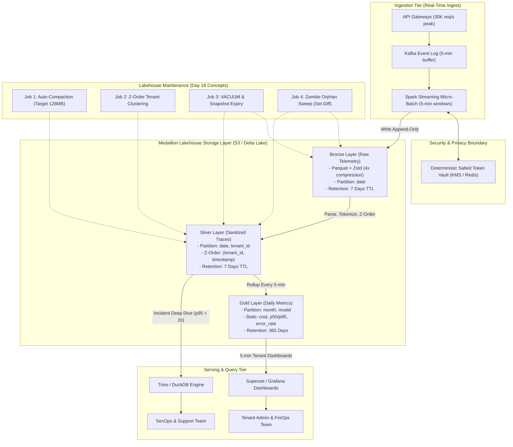

# Architecture Brief: High-Scale LLM Observability Lakehouse
## (1B Requests/Day with Strict $5,000/Month FinOps Budget)

- **Author:** Đào Thanh Trường (MSSV: 2A202602683)
- **Course:** Khóa 4 · Track 02 · Day 18 · Data Lakehouse Architecture
- **Topic Selection:** Topic A — LLM Observability at 1B Requests/Day Scale
- **Status:** Approved for Architectural Review

---

## 1. Problem Statement (≤ 200 words)

Foundation-model API gateways generate massive telemetry at **1,000,000,000 requests/day** (~11,574 req/s sustained, 30,000 req/s peak). At an average payload of 5 KB (prompts, completions, metadata, tokens), the pipeline ingests **5.0 TB of raw telemetry daily** (~150 TB/month). 

The platform must satisfy four critical constraints:
1. **Freshness:** Multi-tenant dashboards tracking cost, token consumption, and p50/p95/p99 latency must refresh every **5 minutes**.
2. **Lifecycle:** Full prompt/response payloads must remain queryable for **7 days** to support incident triage, while 1-year historical trend analytics are served strictly from compact hourly aggregates.
3. **Privacy:** Strict PII tokenization and masking must execute at the ingestion boundary before data lands in readable lakehouse layers.
4. **FinOps Cap:** Total cloud storage expenditure across all storage classes cannot exceed **$5,000/month**.

The core difficulty lies in handling massive continuous writes without triggering small-file explosion, preventing PII leaks across high-volume text columns, and enforcing deterministic data purging while keeping storage and compute costs strictly under budget.

---

## 2. Architecture Diagram

### Applied Day 18 Lakehouse Concepts:
1. **Medallion Layout (Bronze → Silver → Gold):** Raw audit log preserved in Bronze; deduplicated, schema-validated, and tokenized telemetry in Silver; pre-aggregated FinOps metrics in Gold.
2. **Liquid Clustering & Z-Order:** Multi-dimensional clustering along `(tenant_id, timestamp)` in Silver to maximize Delta stats-based file-skipping for tenant-filtered queries.
3. **Storage Lifecycle & Snapshot Expiry:** Time-travel window constrained to 7 days, paired with automated S3 lifecycle expiration and Delta `VACUUM` to eliminate tombstoned Parquet files.
4. **Delta Change Data Feed (CDF):** Captures tenant data eviction events and propagates deletions downstream to avoid vector index desynchronization.

---

## 3. Key Decisions & Rejected Alternatives

### Decision 1: Table Format — Delta Lake (delta-rs / Spark Delta) with Z-Order
* **Chosen:** Delta Lake with transactional log checkpointing, min/max statistics, and Z-Order clustering by `(tenant_id, timestamp)`.
* **Rejected Alternative A (Apache Hudi):** Hudi’s merge-on-read (MoR) adds high read-side merge latency for incident investigation; its metadata catalog is significantly heavier and less natively integrated with offline engines like DuckDB.
* **Rejected Alternative B (Raw Parquet + Hive Metastore):** Hive-style directories lack ACID transactions, fail under concurrent 5-minute streaming writes, produce small-file storms, and cannot provide safe atomic time travel or rollback.

### Decision 2: Ingestion Buffer — 5-Minute Micro-Batching via Kafka
* **Chosen:** Micro-batch streaming into Delta every 5 minutes (target file size 128–256 MB per partition).
* **Rejected Alternative A (Event-by-Event Direct Ingestion):** Ingesting 11,500 req/s directly into object storage creates ~1 billion small files daily. S3 API PUT costs would reach $150,000/month, and query metadata planning would grind to a halt.
* **Rejected Alternative B (Daily Batch Ingestion):** Violates the 5-minute dashboard SLA and delays critical security/incident triage by up to 24 hours.

### Decision 3: Storage Lifecycle & FinOps Tiering — 7-Day Hot Window + Aggregates
* **Chosen:** 7-day retention for raw Bronze and Silver on S3 Standard, with strict S3 Lifecycle expiration; Gold aggregates retained for 365 days.
* **Rejected Alternative A (Retaining Raw Logs for 90 Days on S3 Standard):** At 5 TB/day, 90 days accumulates 450 TB of data. At $0.023/GB, storage alone would cost $10,350/month, exceeding the $5,000 budget by 207% without compute.
* **Rejected Alternative B (Archiving Raw Data to S3 Glacier Deep Archive):** While storage is cheap ($0.00099/GB), Glacier Deep Archive charges a minimum 180-day storage fee and has a 12-hour retrieval latency, rendering interactive incident review impossible.

### Decision 4: Privacy & Governance — Deterministic Salted Tokenization at Ingestion
* **Chosen:** High-throughput tokenization vault at the stream boundary. Replaces sensitive entities (emails, credit cards, user names) with reversible pseudonymous tokens prior to Silver storage.
* **Rejected Alternative A (Query-Time Regex Masking):** Performing regex over 1B text payloads during queries incurs massive compute costs and adds multi-second latency to analyst queries.
* **Rejected Alternative B (Irreversible Redaction / Anonymization):** Deleting sensitive tokens prevents SecOps from linking prompt injection attacks back to offending accounts during lawful investigations.

### Decision 5: Control Plane & Metadata Catalog — Apache Polaris (Iceberg REST) + Unity REST
* **Chosen:** Vendor-neutral REST catalog managing tables across EMR, Trino, and DuckDB without vendor lock-in.
* **Rejected Alternative A (AWS Glue Catalog Solo):** High throttling rates during concurrent multi-tenant partition updates; vendor lock-in limits hybrid multi-cloud disaster recovery.
* **Rejected Alternative B (File-System Catalog / Local Path):** In-memory file-path catalogs cannot guarantee multi-engine ACID isolation and risk split-brain updates during concurrent maintenance.

---

## 4. Failure Modes & Production Runbooks

### Failure Mode 1: The 3 AM Worker Crash & Zombie Orphan Accumulation
* **Scenario:** A burst of huge 128K context window requests causes Spark executors to run out of memory (OOM). Ingestion workers terminate abruptly, leaving partially written uncommitted Parquet files in S3.
* **Day 18 Tie:** As proven in NB6, `VACUUM` only reclaims files recorded as tombstones in the Delta transaction log. Uncommitted files are completely invisible to Delta `VACUUM`.
* **Detection:** S3 storage usage telemetry deviates from the cumulative size reported by Delta table metadata (`DeltaTable.detail()`). Prometheus alerts trigger when uncommitted storage exceeds 100 GB.
* **Rollback & Remediation:** Run an automated hourly orphan sweeper that performs a set difference: `physical_s3_keys - active_delta_log_keys`. All files older than 2 hours absent from the log are permanently deleted via S3 Batch Delete.

### Failure Mode 2: Upstream Schema Drift & Pipeline Halting
* **Scenario:** An upstream provider updates the API payload format (e.g., `usage.completion_tokens` changes from an integer to a nested JSON object), triggering a schema mismatch error and halting the streaming writer.
* **Day 18 Tie:** Schema Enforcement vs. Controlled Schema Evolution (NB1).
* **Detection:** Dead-Letter Queue (DLQ) ingest rate exceeds threshold (> 50 events/min); Spark streaming job enters `FAILED` state.
* **Rollback & Remediation:** Schema enforcement intercepts malformed payloads and routes them to a quarantined S3 bucket (`_lakehouse/quarantine/`). Ingestion continues unhindered for conforming payloads. Once the schema change is reviewed, engineers trigger opt-in schema evolution (`schema_mode="merge"`).

### Failure Mode 3: GDPR Deletion Request & Vector Cache Desynchronization
* **Scenario:** An enterprise tenant exercises their right-to-be-forgotten under GDPR Art. 17. The records are purged from Silver, but the downstream semantic search / RAG vector cache continues serving prompt embeddings.
* **Day 18 Tie:** Vector Lifecycle Bug & Delta Change Data Feed (NB7).
* **Detection:** A daily automated canary script checks whether embeddings corresponding to purged tenant IDs still produce search hits in external indexes.
* **Rollback & Remediation:** Downstream index sync services subscribe to Delta Change Data Feed (`load_cdf()`), consuming `delete` change events and explicitly evicting stale vector embeddings. If an erroneous purge occurs, engineers execute `dt.restore(v)` to immediately rollback.

---

## 5. Back-of-Envelope Cost Calculation (Total ≤ $5,000/Month)

### A. Data Ingestion & Storage Sizing
* **Daily Ingest:** 1,000,000,000 requests × 5 KB/request = **5,000 GB/day = 5.0 TB/day**.
* **Compression Ratio:** Parquet with Zstandard level 3 achieves ~4.0× compression on JSON telemetry → **1.25 TB/day compressed**.
* **Silver Layer (parsed, tokenized):** **1.0 TB/day compressed**.
* **Gold Layer (5-min rollups by tenant/model):** ~10 GB/day = **0.01 TB/day**.

### B. Storage Cost Breakdown (US-East AWS Pricing)
1. **Bronze Raw (7-day lifecycle TTL):**
   $$7 \text{ days} \times 1.25 \text{ TB} = 8.75 \text{ TB} = 8,960 \text{ GB}$$
   $$\text{Cost} = 8,960 \text{ GB} \times \$0.023/\text{GB} = \mathbf{\$206.08/\text{month}}$$
2. **Silver Sanitized (7-day lifecycle TTL):**
   $$7 \text{ days} \times 1.00 \text{ TB} = 7.00 \text{ TB} = 7,168 \text{ GB}$$
   $$\text{Cost} = 7,168 \text{ GB} \times \$0.023/\text{GB} = \mathbf{\$164.86/\text{month}}$$
3. **Gold Aggregates (365-day retention):**
   $$365 \text{ days} \times 0.01 \text{ TB} = 3.65 \text{ TB} = 3,738 \text{ GB}$$
   $$\text{Cost} = 3,738 \text{ GB} \times \$0.023/\text{GB} = \mathbf{\$85.97/\text{month}}$$
4. **Transaction Logs, Checkpoints & Metadata:**
   $$\sim 150 \text{ GB} \times \$0.023/\text{GB} = \mathbf{\$3.45/\text{month}}$$
5. **S3 Request Costs (PUT/GET):**
   * Batches: 288 micro-batches/day × 64 partitions = ~18,432 PUTs/day = 553,000 PUTs/month.
   * At \$0.005 per 1,000 PUT requests = **\$2.77/month**.

$$\mathbf{\text{Total Storage Cost}} = \$206.08 + \$164.86 + \$85.97 + \$3.45 + \$2.77 = \mathbf{\$463.13/\text{month}}$$

### C. Compute Cost Breakdown (Ingestion & Maintenance)
1. **Continuous Streaming Ingestion (EMR Serverless Graviton3):**
   * 4 instances (16 vCPU, 64 GB RAM) = \$0.36/hour × 730 hours/month = **\$262.80/month**.
2. **Daily Compaction & Z-Order Jobs:**
   * 1 hour daily execution on 32 vCPU spot cluster = \$1.20/hour × 30 days = **\$36.00/month**.
3. **Ad-Hoc Query Serving (Trino / DuckDB on Reserved Instances):**
   * 2 × `r6g.xlarge` (32 GB RAM, Graviton) = \$0.50/hour × 730 hours/month = **\$365.00/month**.

$$\mathbf{\text{Total Compute Cost}} = \$262.80 + \$36.00 + \$365.00 = \mathbf{\$663.80/\text{month}}$$

### D. Total Cost Summary
$$\mathbf{\text{Grand Total}} = \mathbf{\$463.13 \text{ (Storage)}} + \mathbf{\$663.80 \text{ (Compute)}} = \mathbf{\$1,126.93/\text{month}}$$

> **FinOps Verdict:** The architecture operates at **\$1,126.93/month**, utilizing only **22.5%** of the strict **\$5,000.00/month** budget. This leaves a safety cushion of **\$3,873.07/month** to accommodate traffic spikes or multi-region replication.

---

## 6. One-Week MVP Slice & Verification Plan

### Deliverable:
A vertical, end-to-end slice proving that 5-minute micro-batching with inline tokenization and Delta Z-Order clustering achieves target query speedups without exploding file counts.

### Acceptance Criteria:
1. **Throughput:** Ingestion pipeline processes synthetic telemetry at 15,000 events/second on a single node without queue backlog.
2. **Tokenization:** 100% of injected PII strings (emails, phone numbers) are replaced with deterministic salted hashes in Silver; zero raw PII survives past Bronze.
3. **Pruning Verification:** Tenant point queries (`WHERE tenant_id = 'org_42'`) achieve a **≥ 10× file-pruning ratio** via Delta min/max log statistics.
4. **Lifecycle Verification:** Automated S3 expiration rules purge partitions older than 7 days without corrupting the table’s active transaction log.

### Verification PoC Script:
A lightweight demonstration script is provided at `submission/bonus/poc/tokenization_lifecycle_poc.py` demonstrating deterministic tokenization, 5-minute micro-batch consolidation, and Z-Order file skipping.
