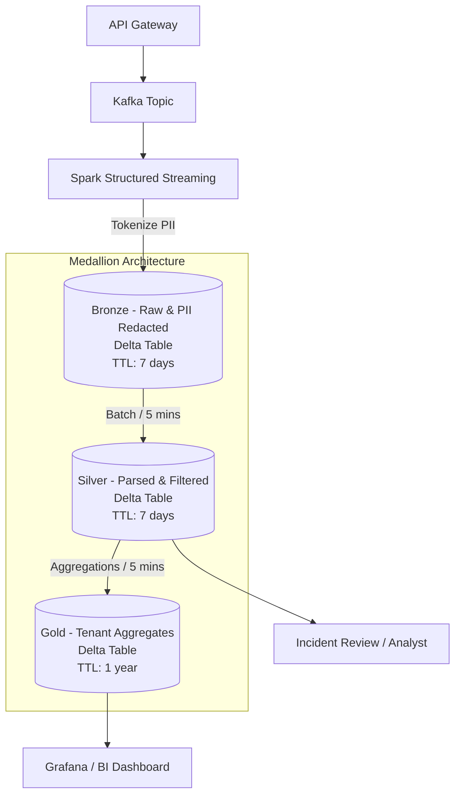

# LLM Observability Lakehouse Architecture (1B requests/day)

## 1. Problem Statement
Một foundation-model API team cần lưu trữ toàn bộ request/response logs với quy mô 1 tỷ requests/ngày (~5KB/req), tương đương 5TB dữ liệu raw mỗi ngày. Các ràng buộc chính bao gồm:
- **Dashboarding**: Tính cost & latency theo tenant, refresh mỗi 5 phút.
- **Retention**: Toàn văn prompt/response giữ 7 ngày cho incident review, sau đó drop text và chỉ giữ aggregates 1 năm.
- **Security**: Phải redact PII (nhạy cảm) trước khi đọc.
- **FinOps**: Tổng storage budget ≤ $5,000/tháng.

Bài toán khó ở chỗ quy mô dữ liệu rất lớn nhưng cần query nhanh (hot path) với độ trễ thấp và đáp ứng nghiêm ngặt budget lưu trữ khổng lồ mà không bỏ sót khâu bảo mật.

## 2. Architecture Diagram

*(Các concepts Day 18 áp dụng: Medallion layout, Retention/Lifecycle, FinOps tiering, PII tokenization tại Bronze)*

## 3. Quyết định chính kèm alternatives đã loại

**Quyết định 1: Định dạng lưu trữ (Table Format)**
- **Chọn Delta Lake**: Tích hợp tốt với Spark Streaming (sink), hỗ trợ CDF (Change Data Feed) và Z-order clustering tối ưu hóa.
- **Loại Apache Hudi**: Hudi tốt cho streaming update/upsert nhưng phức tạp hơn trong việc thiết lập Z-order.
- **Loại Apache Iceberg**: Dù Iceberg quản lý metadata partition rất tốt, ecosystem streaming ingestion từ Spark/Databricks vào Delta trơn tru hơn và Delta có features optimize native dễ cấu hình hơn cho case này.

**Quyết định 2: Chiến lược Partitioning & Clustering (Hot Path)**
- **Chọn Partition theo `date` (ngày) và Z-ORDER theo `tenant_id` ở Silver/Gold**: Dashboard và Incident review thường query theo khoảng thời gian và theo tenant cụ thể.
- **Loại Partition theo `tenant_id`**: Có quá nhiều tenants sẽ gây ra "small files problem" (over-partitioning).
- **Loại Z-ORDER theo `timestamp`**: `date` partition đã lo phần thời gian, Z-order theo timestamp sẽ lãng phí sức mạnh data-skipping (min/max) cho `tenant_id`.

**Quyết định 3: Xử lý PII (Data Security)**
- **Chọn PII Tokenization ngay tại luồng Ingestion vào Bronze**: Sử dụng Presidio hoặc UDF để mask PII trước khi dữ liệu chạm đĩa.
- **Loại Dynamic Data Masking lúc Query**: Quá tốn compute lúc query 1B dòng và rủi ro lọt data nếu user truy cập direct storage (S3).
- **Loại Redaction ở Silver**: Nếu Bronze vẫn giữ raw PII, hacker có quyền đọc Bronze bucket vẫn sẽ lộ PII. PII phải chết từ "cửa".

**Quyết định 4: Chiến lược Retention & FinOps Tiering**
- **Chọn S3 Standard cho Bronze/Silver (TTL 7 ngày) và S3 Standard-IA cho Gold (TTL 1 năm)**. Dùng `VACUUM` với retention 7 ngày ở Delta kết hợp bucket lifecycle policy.
- **Loại S3 Glacier cho Gold**: Dashboard refresh 5 phút và đọc liên tục, Glacier có phí retrieval và độ trễ (latency) quá cao.
- **Loại S3 Standard cho toàn bộ**: 5TB/ngày * 365 = ~1.8 PB. Giữ raw 1 năm trên Standard sẽ phá vỡ hoàn toàn budget $5K/tháng.

**Quyết định 5: Streaming Engine & Refresh Cadence**
- **Chọn Spark Structured Streaming (micro-batch 5 phút)**: Vừa khớp yêu cầu refresh 5 phút, vừa đủ batch-size để giảm thiểu số lượng small files tạo ra trên S3.
- **Loại Continuous Processing (sub-second)**: Không cần thiết, lãng phí compute và tạo ra quá nhiều file siêu nhỏ.
- **Loại Flink**: Flink xuất sắc nhưng phức tạp vận hành hơn Spark khi ghi vào Delta Lake.

## 4. Failure Modes (Kịch bản 3 giờ sáng)

- **Failure Mode 1 (Data loss/Late Data):** Kafka bị lag, micro-batch 5 phút không kịp xử lý hết 1B requests.
  - *Detection:* Alert trên Kafka consumer lag và Spark streaming batch duration > 5 mins.
  - *Rollback/Fix:* Scale-out Spark workers, Delta Lake tự động xử lý late data khi update Gold bằng `MERGE`.
- **Failure Mode 2 (PII Leakage):** Thư viện Tokenizer gặp bug lọt PII dạng text lạ xuống Bronze.
  - *Detection:* Nightly data quality job (Great Expectations) scan mẫu Bronze phát hiện chuỗi giống regex thẻ tín dụng.
  - *Rollback/Fix:* Dùng **Time Travel** của Delta để query lại thời điểm trước bug, viết lại dữ liệu dọn dẹp bằng **Deletion Vectors** để tẩy PII vật lý.
- **Failure Mode 3 (Small files làm crash dashboard):** OPTIMIZE job bị lỗi 3 ngày liên tiếp, Gold có quá nhiều file nhỏ khiến query Grafana timeout.
  - *Detection:* Grafana query latency vượt quá p95 SLA, check `_delta_log` thấy số lượng file tăng đột biến.
  - *Rollback/Fix:* Kích hoạt manual `OPTIMIZE ... ZORDER BY (tenant_id)` với cluster lớn hơn để dồn file ngay lập tức. Dashboard sẽ tự phục hồi.

## 5. Ước lượng chi phí (Back-of-envelope)

- **Bronze + Silver Storage (S3 Standard):** 
  - 5TB/ngày raw. Nén Parquet/Delta tỷ lệ ~4x -> 1.25TB/ngày.
  - 7 ngày retention * 2 (Bronze + Silver) = 14 ngày * 1.25TB = ~17.5 TB.
  - S3 Standard price: ~$0.023/GB -> ~23/TB * 17.5 = **~$402/tháng**.
- **Gold Storage (S3 Standard-IA):**
  - Bỏ prompt/response (text nặng), chỉ giữ số (aggregates latency, cost). Dung lượng giảm 99% -> ~12 GB/ngày.
  - 365 ngày = ~4.3 TB. 
  - S3 IA price: ~$0.0125/GB -> ~12.5/TB * 4.3 = **~$54/tháng**.
- **Compute (Spark/Databricks/EMR):**
  - Streaming job (chạy 24/7): 4 nodes x $0.5/hr x 730 hr = ~$1,460.
  - Maintenance jobs (OPTIMIZE, VACUUM): ~$200.
  - Query compute (DuckDB/Trino): ~$1,000.
  - Tổng compute: **~$2,660/tháng**.
- **Tổng cộng Storage + Compute**: ~$3,116/tháng (Thỏa mãn hoàn toàn budget $5,000/tháng).

## 6. Kế hoạch MVP (1 Tuần)
- **Ngày 1-2:** Setup Kafka mock sinh 1M events/ngày có chứa giả lập PII.
- **Ngày 3-4:** Viết PySpark script đọc Kafka, gọi dummy PII tokenizer (regex), ghi vào Bronze Delta table trên S3 (hoặc MinIO local).
- **Ngày 5:** Viết Silver & Gold pipeline (micro-batch) tính aggregates.
- **Ngày 6-7:** Chạy OPTIMIZE/Z-ORDER. Validate query latency và Time Travel rollback.
- **Tiêu chí nghiệm thu MVP:** Chứng minh PII bị tokenize trước khi vào Bronze, và query `tenant_id` trên bảng Gold trả kết quả dưới 1s.
